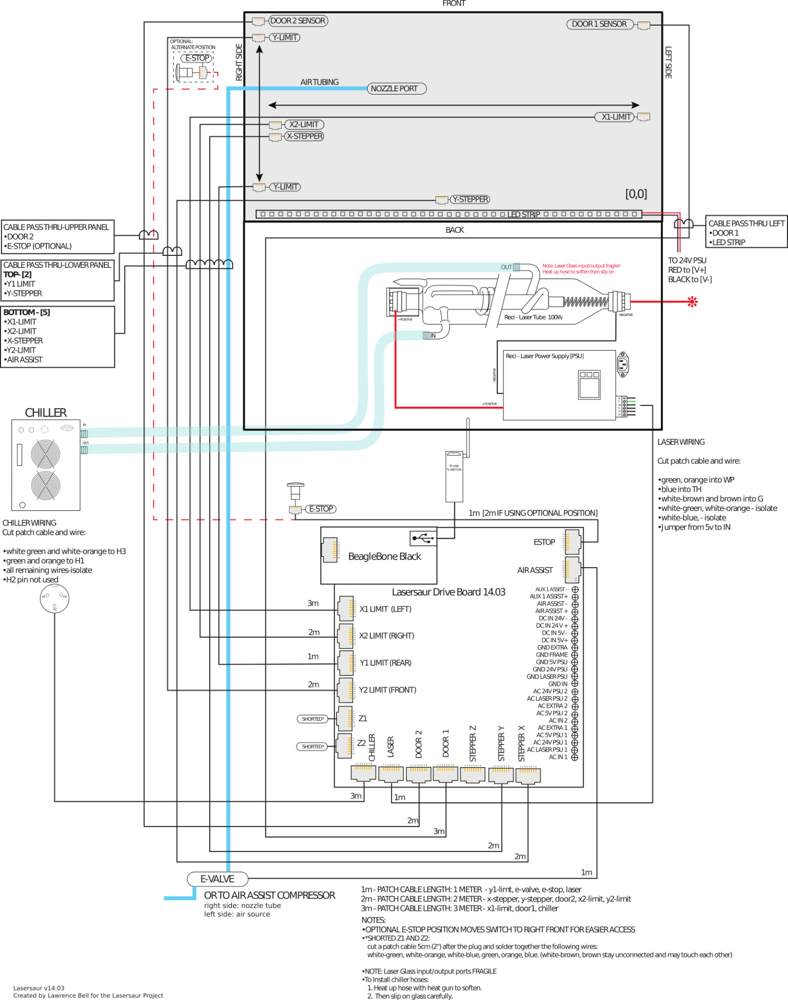
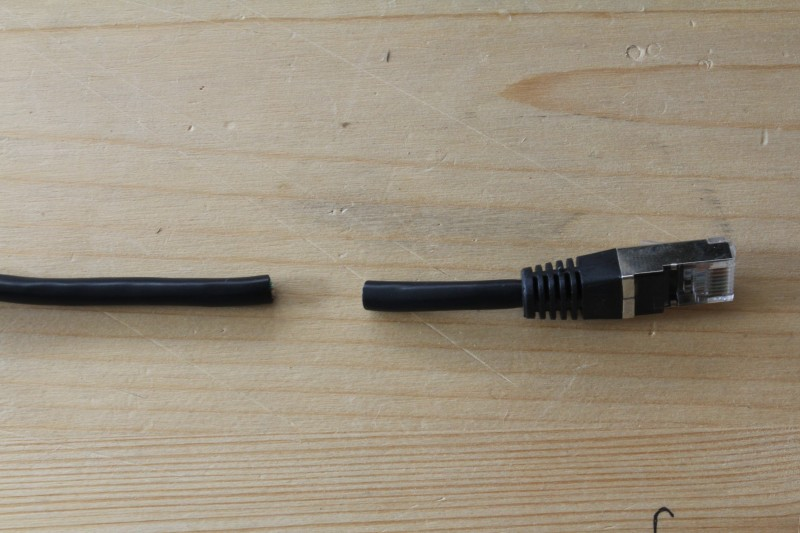
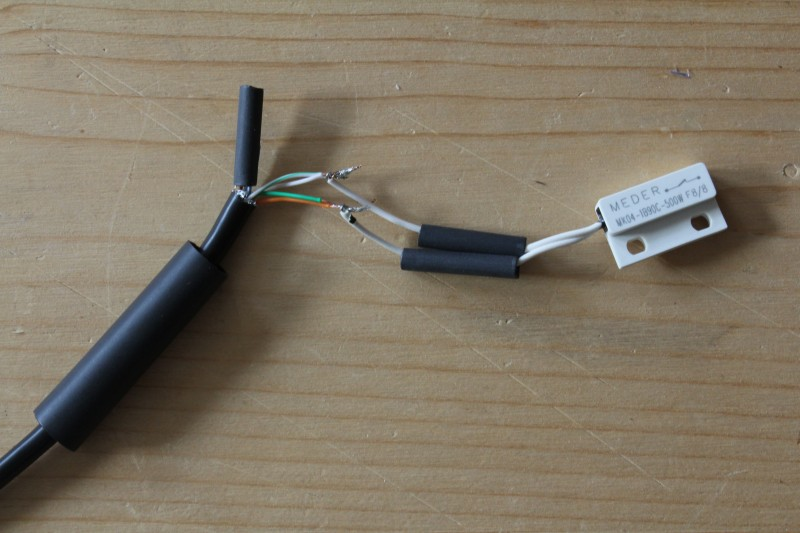
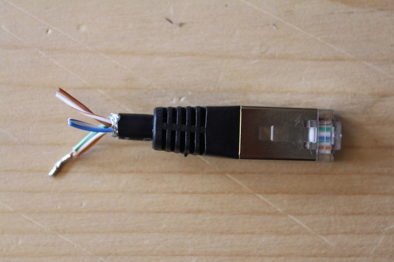
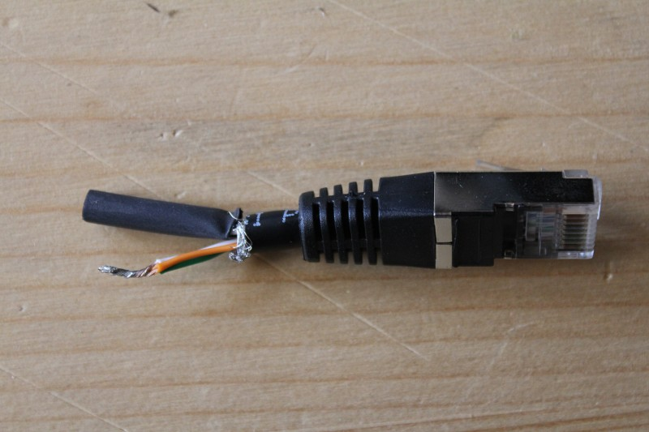
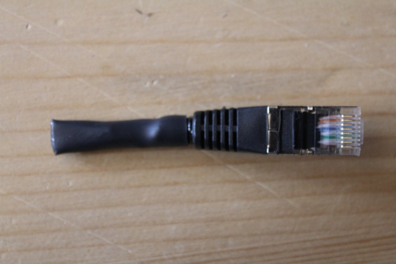
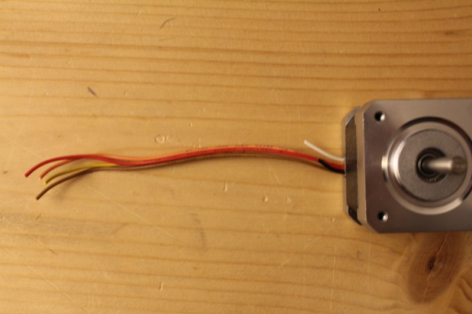
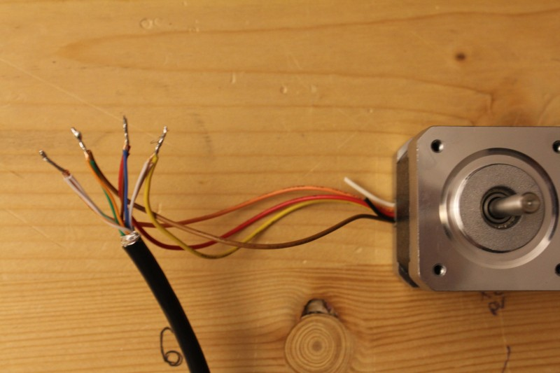
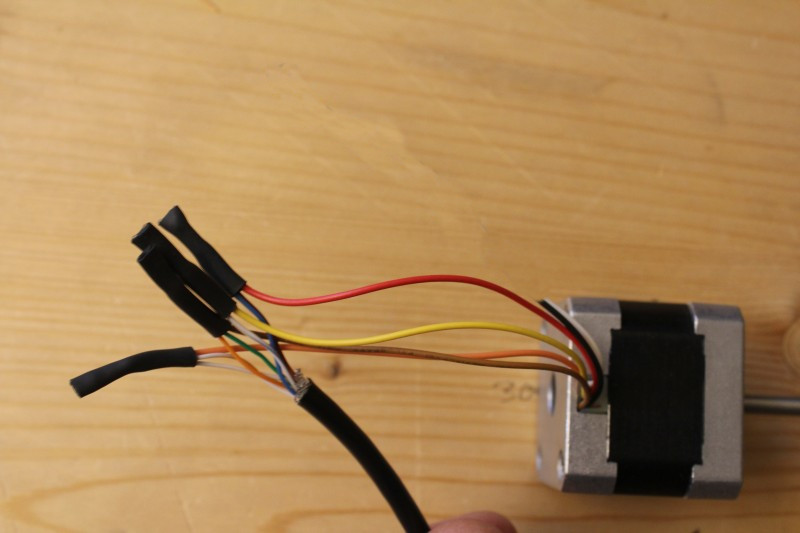
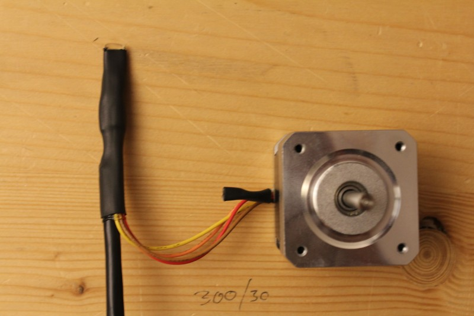

Lasersaur Wiring Guide
======================

[Index](index.md) -- [DriveBoard](driveboard.md) | Wiring Guide

The electronics subsystem consists of the [DriveBoard](driveboard.md) and its sensing and control peripherials: **laser** system, **gantry** steppers, **limit** switches, **door** switches, **chiller**. Additonally it implements a reliable **stop** mechanism.

**WARNING**: The laser PSU supplies the laser tube with roughtly 25kV. This poses a **lethal risk**. Take special care when dealing with the red power cable (rear side of the laser tube) and make sure **proper insulation** is in place before flipping the on switch. Also be informed that the capacitors inside the PSU may possibly stay charged after disconnecting from grid power.

Schematic
---------

Please use this schematic for wiring your Lasersaur. Many details are in the small print and may require you too zoom in and/or download the hi-res version. Soldering/assembly instructions follow below.

[svg](img/wiring-lasersaur-control.svg) | [high-res bitmap](img/wiring-lasersaur-control.jpg)

Assembly of Control and Sensor Wires
------------------------------------
The Driveboard makes extensive use of standard Ethernet patch cables. Laser control, stepper control, e-stop, and all the sensors use them.

Please make sure to use standard patch cables with the following properties: Cat5 , **shielded** (FTP, STP, SFTP), **stranded**, 26 or 25 AWG. Cables with solid leads, cables without a shield, or 27+ AWG cross-section are not suitable. (also see: [Cat5](https://en.wikipedia.org/wiki/Category_5_cable))

We also recommend the following **head shrink tubing** with adhesive on the inside: Mouser: 517-EPS400.35048BLK (0.35", 4:1) and 5174-348018 (0.125", 3:1)

### Limit and Door Switches

Limit and door swiches are mostly identical apart from being inversed from each other. The four **limit switches** (MK04-1B90C-500W) are normally closed (NC). The two **door switches** (MK04-1A66B-500W) are normally open (NO).

- cable length:
  - x1: 3m
  - x2: 2m
  - y1: 1m
  - y2: 2m
  - door1: 3m
  - door2: 2m
- connections:
  - white-green and white-orange **connect to** either side of the switch
  - green and orange **connect to** other side of the switch
  - white-brown and brown **must not connect to** white-blue and blue

### Limit Disable Plugs (z1, z2)

The z-axis limit switches need to be disabled (shorted) when not being used (standard Lasersaur setup). This is accomplished by creating little pig tail plugs for the z1 and z2 limit jacks.

- connections:
  - white-green, white-orange, green ,and orange **connect**.
  - white-brown and brown **must not connect to** white-blue and blue

### X-Stepper Motor

- cable length: 2m
- connections:
  - white-green and white-orange **connect to** orange
  - green and orange **connect to** brown
  - blue and brown **connect to** red
  - white-brown and white-blue **connect to** yellow

### Y-Stepper Motor

- cable length: 2m
- connections:
  - white-green and white-orange **connect to** green
  - green and orange **connect to** black
  - blue and brown **connect to** red
  - white-brown and white-blue **connect to** blue
  - red-white **connects to** blue-white (motor loop)
  - black-white **connects to** green-white (motor loop)

Checklist
---------

1. Is the high-voltage wire (red wire to backside of tube) properly insulated with the insulation cover?
2. Are the AC wires properly insulated and is the Lasersaur frame grounded?
3. Does the E-Stop turn off the machine?
4. Has the chiller's water circulations been properly tested and is the tubing mounted in ways not to cause stress on the inlet and outlet ducts.
